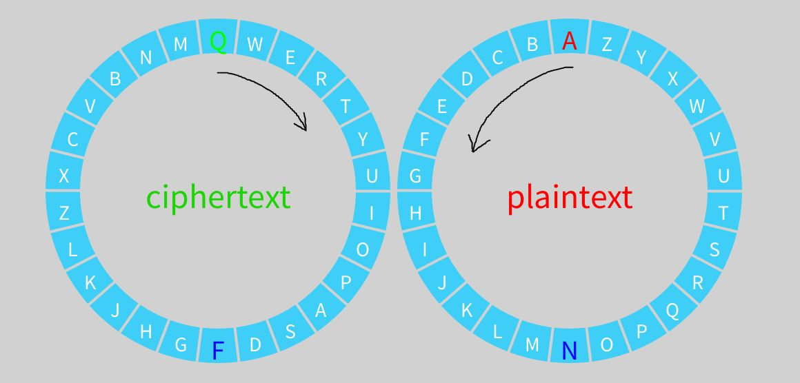

# Presentation Materials
by Jason Ng + Carmin Vuong

## History / Overview
The <b>Chaocipher</b> is a polyalphabetic substitution cipher invented by John Francis Byrne in 1918. He stated that it was a simple, yet unbreakable cipher as the machine he used to encode his messages could fit into a cigar box. He even offered cash rewards for anyone who could crack it! 

The Chaocipher won over numerous cryptoanalysts for almost a whole century. It wasn't until May 2010 when Bryne's daughter-in-law donated Chaocipher related things to the National Cryptologic Museum when the algorithm was finally revealed to the world. 


## How it works
The Chaocipher makes use of 2 disks (left and right), each one having 26 removable "tabs". There are 26 tabs for each of the 26 letters in the alphabet. These 2 disks are connected to one another so when one disk turns, the other disk turns along with it in the opposite direction. (ex. if left turns CW then right turns CCW). On each wheel, the top letter is known as the <b>zenith</b> and the bottom letter is known as the <b>nadir</b>.

When adding the alphabet keys to each wheel, the first letter always starts at the zenith and they go in opposite directions for each wheel. The left wheel will be ciphertext wheel and the right one will be the plaintext wheel.



### Encryption Process
1. Rotate the plaintext wheel (right) until the desired letter to encode is at the zenith position. In turn, the ciphertext wheel will turn accordingly as well.

2. Read the cipher wheel's zenith letter and that will be the corresponding encoded letter. 

3. Permute the left disk. This basically means mixing up the letters in the disks so its harder to decode. Take out the letter at ```zenith+1``` and shift all letters from position ```zenith+2``` until the nadir to the left so that it fills in the empty hole. Finally, re-insert the extracted letter into the nadir.

4. Permute the right disk. Turn <b>ONLY</b> the right disk alphabet so that the letter at position ```zenith+1``` becomes the new zenith. Then remove the letter at position ```zenith+2```. Shift all letters from position ```zenith+3``` until the nadir to the left so that it fills in the empty hole. Finally, re-insert the extracted letter into the nadir position.

This process will be repeated until the desired plain text is fully encoded.

### Decryption Process
The decryption process are functionally identical to the encryption process, except for one thing. This time, the person wanting to decode it will be turning the ciphertext wheel and will be reading off the plaintext wheel. The procedure to permute the wheels are still the same. 


## What We Did! 
Aside from the visualization, we worked on a terminal-based encoder/decoder. 

After we finished the terminal-based encoder/decoder, we decided to work on an encoder/decoder that works for inputs of various lengths (or, at least 3 bytes in length) and for byte data. We could do this as the nadir would always be at least half the key length. We made sure that this could work using the traditional alphabetical chaociphers as the test cases. If it passed the case for an alphabetical cipher (checked by dcode), then that means the cipher works. Of course, this is not like the original chaocipher, so there wasn't a reference to go off of.

This was mainly a fun exercise. Also, it allowed us to create more creative questions for the tryhackme you have for homework! Hooray!


